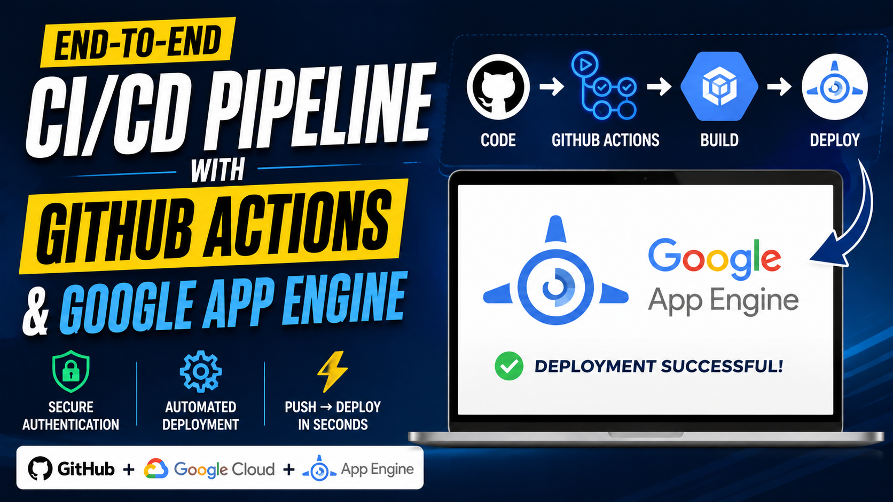

# 🚀 End-to-End CI/CD Pipeline using GitHub Actions & Google App Engine

## 📌 Project Overview

This project demonstrates a complete CI/CD pipeline using GitHub Actions and Google App Engine.

The pipeline automatically:
- Builds the application
- Runs workflow automation
- Deploys application to GCP
- Enables continuous delivery

---

# 🏗️ Architecture Diagram

<p align="center">
  
</p>

---

# ⚙️ Technologies Used

| Technology | Purpose |
|---|---|
| GitHub Actions | CI/CD Automation |
| GCP | Cloud Provider |
| Google App Engine | Deployment |
| YAML | Workflow Configuration |
| GitHub | Source Control |

---

# 🚀 Workflow

1. Developer pushes code to GitHub
2. GitHub Actions workflow triggers
3. Build process starts
4. Deployment to Google App Engine
5. Application becomes live automatically

---

# 📂 Project Structure

```bash
My-GCP-Appengine-project/
│
├── .github/
│   └── workflows/
│       └── deploy.yml
│
├── app.py
├── app.yaml
├── requirements.txt
├── cicd-diagram.png
└── README.md
